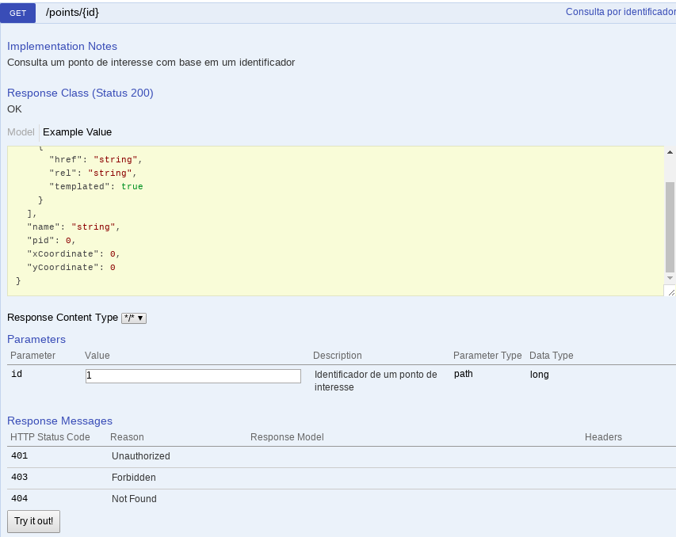

# Pontos de interesse - POI API
Uma API Restful para cadastro e consulta de pontos geográficos de interesse:

* Marque seus lugares favoritos
* Busque lugares dentro de áreas de abrangência
* Exclua os registros de que não precisar mais

## 1. Começando

### 1.1 Login e acesso

Acesse a [API](http://docker150675-env-0262004.jelasticlw.com.br:11389/poi-api/v1/swagger-ui.html) e informe o usuário e senha fornecido a você para começar.

##### Utilize o Swagger

O [Swagger](http://swagger.io/) é um framework amplamente utilizado (entre outras coisas) na documentação de serviços baseados em REST. Nossa API faz uso dele e o link acima leva à sua conhecida interface, que é bastante intuitiva.

### 1.2 Cadastrando pontos de interesse

Utilize o serviço de `POST` **/points**. 

Informe como argumento algo como:

	{
	  "name": "Pizzaria",
	  "xCoordinate": 4,
	  "yCoordinate": 18
	}

Neste exemplo, será cadastrado um ponto de interesse de nome "Pizzaria" com coordenadas x = 4 e y = 18.

### 1.3 Consultando pontos de interesse dentro de uma área circular de abrangência

Utilize o serviço de `GET` **/points**

Informe os seguintes parâmetros:

* `withCenterInX` - a coordenada x do ponto central do círculo de abrangência;
* `withCenterInY` - a coordenada y do ponto central do círculo de abrangência;
* `withRadiusLength` - a distância máxima para consulta a partir do ponto central (raio do círculo de abrangência).

No exemplo da figura, serão retornados todos os pontos de interesse dentro da circunferência de raio 15 centrada no ponto x = 4 e y = 5.

### 1.4 Consultando todos os pontos de interesse

Utilize o mesmo serviço de `GET` **/points** mencionado acima.

Não informe nenhum parâmetro.

Serão retornados todos os pontos de interesse cadastrados.

### 1.5 Consultando um único ponto de interesse

Opcionalmente, utilize o serviço de `GET` **/points/{id}**.

Informe o identificador (id) do ponto de interesse.

Será retornado o ponto de interesse com o id informado.

### 1.6 Excluindo pontos de interesse

Opcionalmente, utilize o serviço de `DELETE` **/points/{id}**.

Informe o identificador (id) do ponto a ser excluído.

## 2. Por trás dos panos

### 2.1 Executando localmente

Caso queira executar localmente a aplicação, a melhor opção, de longe, é o Docker.

##### Utilize o Docker

O [Docker](http://www.docker.com/what-docker) é uma solução para modularização de componentes de aplicações (chamados neste contexto de _containers_), permitindo alta escalabilidade e efetiva separação entre aplicação e infrastrutura.

Você pode encontrar instruções detalhadas para instalar a Docker [aqui](http://www.docker.com/get-docker).

### 2.2 Pré-requisitos

São necessários dois containers, com imagens disponíveis no [Docker Hub](http://hub.docker.com/):

* persistência (**mfsuzigan/mysql**) - com uma imagem ligeiramente modificada do [MySQL](http://www.mysql.com/), contendo instruções para a criação do banco de dados necessário para a API. As tabelas, porém, são montadas (e atualizadas) automaticamente na inicialização da aplicação. Os detalhes desta imagem se encontram no arquivo **mysql.dockerfile** na raiz deste repositório.

* a API REST em si (**mfsuzigan/poi_local**) - criado com base numa imagem base do [Maven](http://maven.apache.org/). Sobe efetivamente a aplicação tirando proveito do plugin para o [Spring Boot](http://projects.spring.io/spring-boot/) que prepara um artefato executável (JAR) no build do projeto. É dependente do container de persistência (acima). Detalhes no arquivo **poi_local.dockerfile** na raiz deste repositório.

### 2.3 Comandos

Os comandos abaixo podem ser orquestrados com o **Docker Composer**, mas evitando a inclusão de mais um pré-requisito ao projeto, as instruções consideram apenas a utilização do Docker. 

Com o Docker e uma conexão de internet disponível, abra um console de linha de comando de sua opção e digite:

`docker network create --driver bridge poi-net`

O Docker criará uma rede para a comunicação entre os dois containers de nome "poi-net" usando o driver padrão (bridge).

Em seguida, digite:

`docker run -d --name mysql -p 3306:3306 --network=poi-net mfsuzigan/mysql`

Isto instruirá o Docker a criar um container de nome "mysql" com base na imagem "mfsuzigan/mysql", que será baixada do Docker Hub na primeira execução. Ele mapeará a porta 3306 interna ao container à porta 3306 da sua máquina e liberará a linha de comando (modo _detached_). O container pertencerá à rede "poi-net".

Em seguida, execute:

`docker run -it --name poi -p 8080:8080 --network=poi-net mfsuzigan/poi_local`

O Docker criará o segundo container com o nome "poi" na rede "poi-net", ligando as portas 8080 internas e externas a partir da imagem "mfsuzigan/poi_local" - também baixada do Docker Hub na primeira execução. 

Note que o modo não é detached, mas sim interativo, permitindo que você acompanhe o log do Spring Boot pelo console. 

Assim que ele finalizar, acesse a aplicação informando usuário e senha em:

[http://localhost:8080/poi-api/v1/swagger-ui.html](http://localhost:8080/poi-api/v1/swagger-ui.html)

### 2.4 Carga inicial do banco de dados

Foi disponibilizado um _shell script_ para a carga inicial do banco de dados nesta primeira versão da API. Ele faz uso do aplicativo **curl**, nativo das distribuições mais comuns de Linux.

Com a aplicação executando localmente, navegue até o diretório /src/main/resources deste repositório e conceda permissão de execução ao script:

`sudo chmod +x load.sh`

Em seguida, execute-o:

`./load.sh [usuario] [senha]`